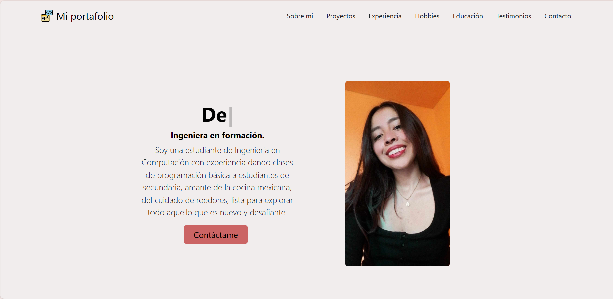
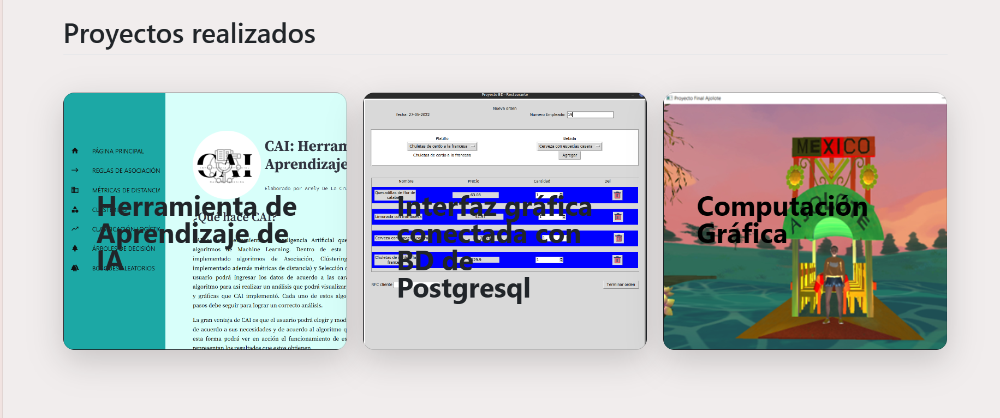
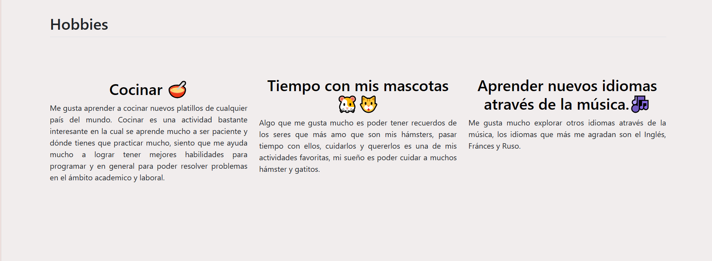
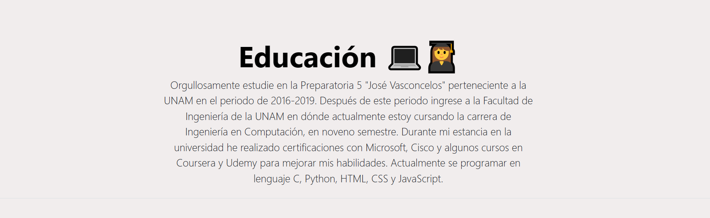

# Portafolio personal: Tecnolochicas PRO

Este proyecto fue creado durante el bootacamp Technolochicas PRO, es una página web responsiva (adaptable a diversos dispositivos).

El propósito de la creación de este sitio web es mostrar el portafolio de proyectos de la desarrolladora y su experiencia alrededor del área.

Incluye las secciones: sobre mí, proyectos, experiencia, hobbies, educación, testimonios y contacto.

Incluye recursos multimedia.

<a href="https://graceful-lolly-d98c84.netlify.app/" target="_blank">**Visitalo ahora** 🚀</a>
# Secciones (capturas de pantalla)

Sobre mí:

Proyectos:

Experiencia:

Hobbies:

Educación:

Contacto:

# Tecnologías

## 📬 Contacto

<a href="mailto:arely.delacruz.munguia@gmail.com"></img></a>

© 2023 Arely (Programa Technolochicas PRO)